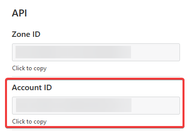

# Cloudflare Page Deploy

A Github Action that triggers a deployment with [Cloudflare Pages](https://pages.cloudflare.com/). Useful to have more control on when deployments are triggered with Cloudflare.


## Configuration

**All senstive information like account, email and global token should be stored with [encrypted secrets](https://docs.github.com/en/free-pro-team@latest/actions/reference/encrypted-secrets)**

### Account ID

Your account ID will be on the bottom right of the overview page for your domain.



### Setting up Authentication

Currently, the only way to authicate with pages is using global authication.

1. Log in to Cloudflare and go to **My Profile** -> **API Tokens** -> **Global API Key**
2. You will need to enter your password to get the key.
3. Copy that key into a secret on Github and you will be able to use it.


### Example workflow


```yaml

name: Deploy Site
on: push

jobs:
  deploy:
    runs-on: ubuntu-latest
    steps:

    # Put steps here to build, and check your site.

    - name: Clear Cloudflare cache
      uses: Cyb3r-Jak3/actions-cloudflare-pages@<Latest Release>
      with:
        account: ${{ secrets.CLOUDFLARE_ZONE }}
        project: ${{ secrets.CLOUDFLARE_PROJECT }}
        email: ${{ secrets.CLOUDFLARE_EMAIL }}
        global_token: ${{ secrets.CLOUDFLARE_KEY }}
```

## Keep up-to-date with GitHub Dependabot

Since [Dependabot](https://docs.github.com/en/github/administering-a-repository/keeping-your-actions-up-to-date-with-github-dependabot)
has [native GitHub Actions support](https://docs.github.com/en/github/administering-a-repository/configuration-options-for-dependency-updates#package-ecosystem),
to enable it on your GitHub repo all you need to do is add the `.github/dependabot.yml` file:

```yaml
version: 2
updates:
  # Maintain dependencies for GitHub Actions
  - package-ecosystem: "github-actions"
    directory: "/"
    schedule:
      interval: "weekly
```
   